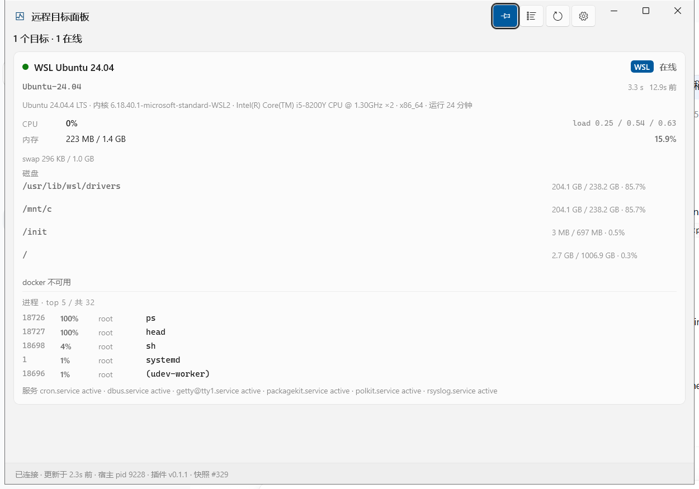
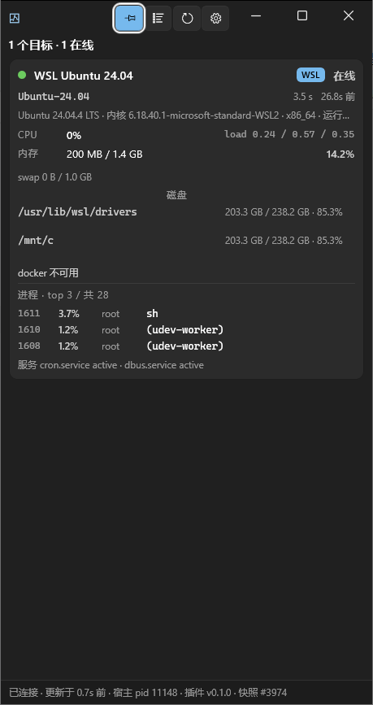

# dsh-remote-panel

<!-- 中文 | English -->
**中文** ｜ [English](#english)

一个 DSH（DeepSeek Harness）插件：探测**本地 WSL 发行版**和**通过 SSH 连接的远程机器**——CPU、内存、磁盘、GPU、Docker、进程和 systemd 服务——把结果写成一份原子更新的 JSON 快照，并以四种方式呈现这份快照。

| 界面 | 使用者 | 形态 |
| --- | --- | --- |
| `remote_*` agent 工具 | 模型 | 结构化 JSON + 一行结论 |
| `/wsx ...` 会话命令 | 人 | 对齐的纯文本表格 |
| WinUI 3 桌面面板 | 人 | 置顶的原生窗口，实时 |
| MCP stdio 服务器 | 任意 MCP 客户端 | 与工具**同一份实现** |

另外还有一个 **GUI 内的网页面板**（DSH 侧边栏里的 "remote targets" 图标），在浏览器里渲染同一份快照。

```
┌─ Remote targets ───────────────── [Probe now] [Open panel] ── ─ □ ✕ ┐
│ 3 targets · 2 online · 1 offline                                     │
│                                                                      │
│ ┌──────────────────────────────────────────────────────────────────┐ │
│ │ ● WSL Ubuntu 24.04    WSL  127.0.0.1                   82ms      │ │
│ │   CPU 6.5%   MEM 16.3% · 229M/1.4G   load 1.12 .26 .09           │ │
│ │   /            2.8% · 1.0T free                                  │ │
│ │   /mnt/c      86.7% · 33.8G free                                 │ │
│ │   probed 2s ago                                                  │ │
│ └──────────────────────────────────────────────────────────────────┘ │
│ ┌──────────────────────────────────────────────────────────────────┐ │
│ │ ✕ lab-gpu-01         SSH  192.168.1.50                           │ │
│ │   connect timeout: waited 20s for 192.168.1.50                   │ │
│ │   (is sshd reachable? is key auth working?)                      │ │
│ │   probed 12s ago · 3 consecutive failures                        │ │
│ └──────────────────────────────────────────────────────────────────┘ │
└──────────────────────────────────────────────────────────────────────┘
```

**功能概要**

- **默认只读探测，写操作只需一个开关。** 每个写操作（docker/service 启停、文件上传）都由 `allowMutations` 把关；`kill` 另有独立的 `confirm: true` 门禁，并拒绝 PID 1。
- **自身不持有任何凭据。** 它调用系统的 OpenSSH 客户端，所以你现有的 `~/.ssh/config`、ssh-agent 和 `known_hosts` 直接可用。
- **面板侧不轮询。** 快照就是一个文件，原子写入。
- **零运行时 npm 依赖** —— 只用 Node 内置模块。
- **自带预编译面板。** `dist/` 是一份自包含的 .NET 8 publish：目标机器不需要 .NET 运行时、不需要 Windows App Runtime，也不需要 MSIX。
- **附带 Skills。** 两份 agent 操作手册：使用方式，以及分层排错。

---

## 截图

原生 WinUI 3 面板，显示一个在线的 WSL 目标和一个连接失败的 SSH 目标：



窄宽度下：



> **窄宽度下已知的布局问题。** 这张窄截图是诚实的，不是美化的：窗口被压窄时，指标行会以别扭的方式折行，过长的错误字符串会溢出卡片而不是干净地省略，每个目标的标题也可能挤到状态徽标上。面板在这些宽度下能用，但看得出没打磨完。目前也没有紧凑的“单个数字”模式。修这些问题在待办列表上；请把这两张截图当作当前状态，而不是预期状态。

---

## 环境要求

| | 要求 |
| --- | --- |
| 操作系统（面板） | Windows 10 1809（build 17763）或更新 —— 这是 WinUI 3 的要求 |
| 操作系统（其余部分） | 任何能跑 Node 的平台：`/wsx`、工具、MCP 和 Skills 都与平台无关 |
| DSH | 带插件系统的版本（bundle 机制 + `dsh.client` 客户端模块） |
| 远程目标 | 任何运行 **sshd** 的类 Unix 主机（Linux / macOS / WSL） |
| *使用*它 | **什么都不用装** —— `dist/` 是自包含的；不需要 .NET 运行时，也不需要 Windows App Runtime |
| *开发*它 | .NET 8 SDK（构建窗口）+ Node.js 20（跑测试）；**不需要 Visual Studio** |

> **非 Windows 主机：** 插件的 host 那半边能加载，命令和工具都能用，但面板是 WinUI 3 程序，所以没有浮窗。网页面板正常工作。

---

## 架构

| 部分 | 位置 | 职责 |
| --- | --- | --- |
| Host 插件 | `lib/index.js` | 接线、调度、采集、写快照、注册命令/工具/路由 |
| 传输 | `lib/ssh.js` | 两条通道：系统 OpenSSH（复用 `~/.ssh/config` 和 agent）与 `wsl.exe` |
| 采集 | `scripts/probe.sh` | 一份**自包含**的只读脚本，喂给目标的 POSIX shell |
| 解析 | `lib/probe.js` | 把分节文本转成结构化指标 |
| 调度 | `lib/manager.js` | 并发上限、离线退避、冷启动错峰、心跳写入 |
| 桌面面板 | `app/` | WinUI 3（C#/.NET 8）程序；读取快照并渲染 |
| 网页面板 | `lib/client.js` | DSH 侧边栏图标 + 中栏实时面板 + "open desktop panel" 按钮 |
| MCP | `bin/mcp-server.js` | 零依赖的 MCP stdio 服务器 |
| Skills | `skills/` | 两份给 agent 的操作手册 |

Host 和窗口之间通过一个**状态文件**通信，而不是 HTTP：

```
$DSH_HOME/remote-panel/state.json          # %USERPROFILE%\.dsh\remote-panel\state.json by default
```

它用**临时文件 + rename** 写入，所以读取方永远不会看到半份 JSON 文档。旁边 host 还会写 `config.resolved.json`（归一化后的配置），独立运行的 MCP 服务器因此能看到与 DSH 完全相同的目标列表。

### 为什么用状态文件而不是 HTTP

DSH 的 web 服务器有一道信任栅栏：非 loopback 的 Host 头和未认证请求会被直接拒绝。插件*确实*可以注册路由，但一个外部的原生进程仍然得自己解决认证和端口发现问题。状态文件不需要认证、不需要端口，同一个用户就能读，而且天然支持两种启动顺序——“窗口在 host 之后启动”和“host 重启后窗口重连”。

> 例外是**网页面板**：它活在浏览器里，那本来就是同源环境，所以它使用 host 注册的 `/dsh-remote-panel/*` 路由。这些路由会开真实的 SSH 连接并返回机器信息，所以 host 在它们前面放了一道 loopback 信任栅栏：逐段校验 Host，拒绝 `Sec-Fetch-Site: cross-site`，只要带了 `Origin` 就必须同源，不是 POST 的一律 405，任何异常都按失败关闭（fail closed）。

---

## 安装

首次安装的分步指南见 **[INSTALL.md](INSTALL.md)**。

简版：这是一个标准的 DSH bundle 包 —— `package.json` 的 `dsh.bundle.patch` 指向 `cordis.patch.yml`，由它把 host 插件、skills 和 MCP 服务器插入 profile 的配置树。

```powershell
# Plugin Manager: add a package, "link:" + the absolute path of this folder
link:C:\path\to\dsh-remote-panel

# or the command line
dsh plugin --profile desktop add link:C:\path\to\dsh-remote-panel   # local dev: edits apply without reinstalling
dsh plugin --profile desktop add C:\path\to\dsh-remote-panel        # copy it into the profile
```

bundle 变更要生效，**必须重启 DSH**。

---

## 配置目标

目标写在 profile 的 `cordis.patch.yml` 里，位于 `dsh-remote-panel` 那一行的 `config.targets` 下。**改完重启 DSH。**

```yaml
- id: dsh-remote-panel
  name: dsh-remote-panel
  config:
    targets:
      # A local WSL distribution
      - kind: wsl
        name: WSL Ubuntu 24.04
        distro: Ubuntu-24.04
        channel: auto          # auto = try SSH first, fall back to wsl.exe
        user: root             # optional: the default user for a WSL target is "root"
        tags: [local]
        services: [ssh, docker, cron]

      # A remote machine (IP or hostname)
      - kind: ssh
        name: lab-gpu-01
        host: 192.168.1.50
        port: 22
        user: ubuntu
        identityFile: ~/.ssh/id_ed25519
        tags: [lab, gpu]

      # Or just use a Host alias from ~/.ssh/config
      - kind: ssh
        name: prod-web-1
        host: prod-web-1
        user: deploy
```

目标可以用 `id`、`name`、主机名，或其中任意一个的**唯一片段**来选中。省略 `id` 时，它由 `kind` + `user` + `host` 推导出来——例如 `ssh-ubuntu-192.168.1.50`。

### 配置项参考

| 选项 | 默认值 | 说明 |
| --- | --- | --- |
| `enabled` | `true` | `false` 会停止所有探测。插件仍然加载，命令/工具/面板仍然可用，但每个目标都停在 `unknown`。 |
| `probeIntervalMs` | `15000` | 探测间隔（钳制在 3000–3600000）。 |
| `timeoutMs` | `60000` | **全局**单次探测超时（钳制在 3000–600000）。WSL 冷启动要花 18–88s —— 如果你会盯着 WSL，别调低这个值。 |
| `targets[].timeoutMs` | 继承全局值 | 单目标覆盖（同样是 3000–600000 的钳制）。只收紧某一个目标——比如一直温热的 WSL 发行版，或纯 SSH 部署。 |
| `connectTimeoutMs` | `10000` | 建连超时（ssh 的 `ConnectTimeout`）。**真正能逮住“机器确实挂了”的就是它**，所以全局那 60s 永远不会让你白等。 |
| `probeOnStart` | `true` | 插件启动时探测一次（错峰进行）。 |
| `maxConcurrentProbes` | `4` | 同时探测多少个目标（钳制在 1–32）。 |
| `allowMutations` | `true` | 写操作总开关；`false` 即保持只读。 |
| `collectDocker` | `true` | 采集开关——关掉能减轻目标端负载。 |
| `collectProcesses` | `true` | |
| `collectServices` | `true` | |
| `collectGpu` | `true` | |
| `historyLength` | `40` | 每个目标保留多少条历史样本用于趋势线（钳制在 0–600）。一次失败仍会推入一个 `latencyMs=0` 的断点。 |
| `flushIntervalMs` | `500` | 调度器 tick 周期（钳制在 100–60000）。 |
| `heartbeatMs` | `2000` | 什么都没变时多久重写一次快照——面板靠它区分“没变化”和“host 没了”（钳制在 500–300000）。 |
| `autoLaunch` | `true` | DSH 启动时打开面板窗口。 |
| `appPath` | `''` | 面板 exe 的显式路径；留空表示“在包内查找”。 |
| `stateFile` | `$DSH_HOME/remote-panel/state.json` | 快照写入的位置。 |
| `targetsFile` | — | 从一个 JSON 文件读取额外的目标数组。 |
| `ssh.executable` | 自动检测 | 显式指定 `ssh.exe`。 |
| `ssh.user` | `''` | `kind: ssh` 目标的默认用户。 |
| `ssh.port` | `22` | `kind: ssh` 目标的默认端口。 |
| `ssh.identityFile` | `''` | 默认身份文件。 |
| `ssh.commonFlags` | `[]` | 追加到每次 ssh 调用后的额外 argv。 |
| `ssh.controlMaster` | `true` | 连接复用。热探测从 ~300ms 降到 ~80ms。 |
| `ssh.controlPersistSec` | `60` | 复用的 master 保持存活多久（钳制在 0–3600）。 |
| `wsl.executable` | `wsl.exe` | |
| `wsl.defaultUser` | `''` | 目标没有 `user` 时使用。 |

单目标选项：`kind`（`wsl` | `ssh`）、`id`、`name`、`distro`、`host`、`port`、`user`、`channel`（`auto` | `ssh` | `wsl`）、`identityFile`、`sshConfigHost`、`strictHostKeyChecking`、`timeoutMs`、`tags`、`enabled`、`services`。`kind: wsl` 目标还可以设 `sshPort`（默认 `2222`）——那是通过 SSH 访问该 WSL 目标时使用的端口，这类目标的 host 侧永远是 `127.0.0.1`。

> **为什么 `timeoutMs` 默认是 60000。** 最后一个 `wsl.exe` 会话结束约一分钟后，WSL 会把整个发行版拆掉，所以冷启动的第一次探测要花 **18–88s**。早先 20s 的默认值让健康的 WSL 目标每隔几轮就抖成 “offline”——数据是对的，只是还没到。真正的浪费（等一台根本连不上的机器）改由 `connectTimeoutMs` 吸收，所以 60s 只作用于“连得上但很慢”的目标——而这正是 WSL 冷启动的样子。已经温热的部署可以用 `targets[].timeoutMs` 收紧单个目标。

---

## 通道，以及 WSL 的两个坑

`kind: wsl` 目标有两条到达路径；由 `channel` 决定：

| `channel` | 行为 | 适用场景 |
| --- | --- | --- |
| `auto`（默认） | **先试 SSH，失败则回落到 `wsl.exe`** | 大多数情况 |
| `ssh` | 只用 SSH | 发行版里跑了 sshd |
| `wsl` | 只用 `wsl.exe` | 没有 sshd，且当前会话拥有完整访问权限 |

### 坑 1：受限沙箱下 `wsl.exe` 会被拒绝

DSH 的 Windows 沙箱把子进程降到 Low 完整性级别，而 WSL 服务拒绝这类调用者：

| 方式 | 受限沙箱下 |
| --- | --- |
| `wsl.exe -l -v`、`wsl.exe -d ... -- cmd` | `Wsl/E_ACCESSDENIED` |
| `\\wsl.localhost\Ubuntu-24.04\...` | 拒绝访问 |
| **SSH 到 WSL 内部的 sshd** | 可用，受限和完整访问下都可用 |

这就是 `channel: auto` 优先走 SSH 的原因。插件把这个特定的失败当成一种可诊断的状态，而不是泛泛的错误：一旦看到 `Wsl/E_ACCESSDENIED`，它会明说，并指向 SSH 路线。`wsl-link` skill 会在发行版里部署一个 sshd（监听 `127.0.0.1:2222`，仅 loopback，仅公钥认证）。

### 坑 2：WSL 冷启动要花 18–88 秒

**最后一个 `wsl.exe` 会话结束约一分钟后，WSL 会把整个发行版拆掉**——即使 SSH 正在用它。所以空闲期之后的第一次调用要付冷启动的代价，紧接着的那次不到一秒。这不是故障。

要么接受它（全局默认 `timeoutMs: 60000` 已经覆盖了），要么在 `%USERPROFILE%\.wslconfig` 的 `[wsl2]` 下加 `vmIdleTimeout=3600000` 把它消掉——代价是发行版会长期占着约 1.4 GB 内存。

当一次探测耗时 10 秒或更多，面板会把那张卡片标为**冷启动**，这样第一次采样慢就不会被误当成链路坏了。

### 认证：只能用密钥或 agent

插件**总是**带上 `ssh -o BatchMode=yes`（以及 `NumberOfPasswordPrompts=0`）。因此它永远不可能弹密码提示——在没有 TTY 的子进程里，密码提示只会一直挂到探测超时。如果某个目标一直 `offline`，先检查免密登录：

```powershell
ssh -o BatchMode=yes -o ConnectTimeout=10 -o NumberOfPasswordPrompts=0 -- user@192.168.1.50 'echo OK'
```

---

## 用法

更深入的参考资料（与本 README 一同编写）：

- [docs/commands.md](docs/commands.md) —— 每个 `/wsx` 子命令及其示例输出
- [docs/skills.md](docs/skills.md) —— 两个 Skills 教了 agent 什么
- [docs/mcp.md](docs/mcp.md) —— 运行和接入 MCP 服务器

### `/wsx ...` 命令

```
/wsx                    status overview of local WSL and remote machines
/wsx status [target]    status overview (optionally one target)
/wsx list               list all configured targets and their channel
/wsx probe [target]     probe now (all targets when none is given)
/wsx docker [target]    list containers
/wsx services [target]  list key service states
/wsx ps [target] [n]    list processes by CPU
/wsx exec <target> <cmd> run a command on the target
/wsx panel              show / raise the desktop panel window
/wsx open               open the plugin data directory and the state file
/wsx help               the command list above
```

`/wsx list` 还会打印一行**工具注册路径**，说明这些工具是通过官方的 `defineTool` 助手注册的（附带额外的 schema 校验），还是回落到裸 JSON Schema。两者都能用。

> 在开发这个插件的机器上，跑的是回落（`raw`）路径，原因值得记下来：`@deepseek-ai/*` 这些包**只存在于 `app.asar` 内部**，没有被解包到磁盘，所以第三方插件的 ESM `import('@deepseek-ai/dsh-tools')` 在 Node 里解析不了（`Cannot find package '@deepseek-ai/dsh-tools'`）。
>
> 于是插件用 `projectParameters()` 把自己的参数方言翻译成标准 JSON Schema，再走 `ctx.tools.register` 的 raw 路径注册——这条路径只用 Node 内置能力，因此永远可用。那行注册路径会如实报告正在走哪条路；**看到 `raw` 不是故障。** 两条路径的行为、参数校验和安全门禁完全一致。

### Agent 工具

七个 `remote_*` 工具，与 MCP 服务器共用同一份实现和同一套门禁：

| 工具 | 用途 |
| --- | --- |
| `remote_status` | 目标总览；`refresh: true` 立即重新探测 |
| `remote_exec` | 在目标上执行命令，返回 stdout/stderr/退出码 |
| `remote_files` | `list` / `read` / `upload` / `download` |
| `remote_docker` | `ps` / `logs` / `start` / `stop` / `restart` / `pause` / `unpause` |
| `remote_services` | `status` / `start` / `stop` / `restart` / `reload` |
| `remote_processes` | `list`（按 cpu/mem）和 `kill` |
| `remote_panel` | 显示 WinUI 3 面板窗口 |

### MCP

`cordis.patch.yml` 里已经有一行，把这套相同的能力通过 MCP stdio 暴露出去：

```yaml
- id: mcp-remote-panel
  name: '@deepseek-ai/dsh-mcp-client'
  config:
    serverName: remote_panel
    transport: stdio
    command: !!js process.execPath
    args: !!js "process.env.DSH_PROFILE_DIR ? [process.env.DSH_PROFILE_DIR + '/node_modules/dsh-remote-panel/bin/mcp-server.js'] : []"
```

这些工具会以 `mcp__remote_panel__<tool name>` 的形式出现。不想要 MCP 就整块删掉——不影响别的任何东西。（真实文件里还设了 `cwd`、`failOnStartupError: false` 和 `toolCallTimeoutMs`；上面这段摘录裁到只剩理解接线方式所需的部分。）

不用 DSH，手动验证 MCP 服务器：

```powershell
$env:DSH_WSX_CONFIG = '{"config":{"targets":[{"kind":"wsl","distro":"Ubuntu-24.04","channel":"wsl","user":"root"}]}}'
'{"jsonrpc":"2.0","id":1,"method":"tools/list"}' | node .\bin\mcp-server.js
```

`stdout` 上只能有协议 JSON（按换行分隔）；**所有诊断信息都走 `stderr`。** 给那个文件加日志时请写 `stderr`——`stdout` 上多一个字符就会破坏协议。

目标列表来自 host 插件写出的 `config.resolved.json`，所以 MCP 侧和 DSH 侧看到的目标永远一致；配置合并逻辑没有在那里重新实现一遍。

### Skills

两个 skill，装好之后 agent 可以加载：

| Skill | 用途 |
| --- | --- |
| `remote-panel` | 什么时候该用哪个界面、典型工具用法、WSL 的两条通道和冷启动 |
| `remote-panel-troubleshooting` | 分层诊断：配置 → 链路 → 采集 → 状态文件 → MCP → 被拒的写操作 |

它们由 `install.ps1`（以及 [INSTALL.md](INSTALL.md) 里的手动步骤）装进 DSH 默认的 skill 扫描根目录 `$DSH_HOME/skills/`，而不是通过 bundle patch。`cordis.patch.yml` 里的长注释解释了为什么 bundle patch 在这里无法启用 `skill-filesystem`（web-app 层禁用了那一行，而非 `insert` 的 patch 只赋值它携带的键，因此永远清不掉继承来的 `disabled`）。**对 skill 内容的修改实时生效**——那个目录被监视着；代码和配置的改动需要重启。

---

## 构建面板

```powershell
.\build.ps1              # Release build (for development)
.\build.ps1 -Pack        # publish into dist\ (the shipping location)
.\build.ps1 -Clean       # clear bin/obj/dist
```

**你不需要 Visual Studio。** 关键在于 csproj 里的 `EnableMsixTooling=true`：它决定用哪套 PRI 工具链。设成 `false` 会回落到 `MrtCore.PriGen.targets`，它依赖 `Microsoft.Build.Packaging.Pri.Tasks.dll`——一个只在 Visual Studio 里才有的程序集——于是在干净的 .NET SDK 上必然以 `MSB4062: ... ExpandPriContent` 失败。设成 `true` 时，改用 Windows App SDK NuGet 包内随附的独立工具链。打包本身则由 `WindowsPackageType=None` 关掉。

`dist/` 是一份**自包含**发布，带着完整的 .NET 和 Windows App SDK 运行时（视剪裁情况约 163 MB / 约 324 个文件）。换来的是：目标机器不需要 .NET 运行时、不需要 Windows App Runtime，也不需要 MSIX 注册——拷过去就能跑。

`build.ps1 -Pack` 还会剪掉 `.pdb` 文件和未使用的本地化 satellite 目录，然后跑一次无头自检（`test/run-checks.ps1`，用面板的 `--dump-status`）来确认发布出来的 exe 真的能启动，而不只是躺在磁盘上。

---

## 签名（要清楚它做了什么、没做什么）

发布出来的 exe 是**未签名**的，所以第一次启动时 Windows 会弹一个“未知发布者——你确定要运行这个软件吗？”的安全警告。`build.ps1 -Pack` 会在发布之后给它签名；你也可以单独运行：

```powershell
.\sign-panel.ps1              # create/reuse a code-signing certificate, trust it, sign the exe
.\sign-panel.ps1 -Uninstall   # revoke: remove the signature and the certificate
```

它做四件事，而且**只写当前用户的 HKCU 存储——不碰机器级证书存储，也不需要管理员权限**：

1. 在 `CurrentUser\My` 里创建（或复用）一张自签名的代码签名证书；
2. 把它的公钥加进 `CurrentUser\Root` 和 `CurrentUser\TrustedPublisher`；
3. 用它给 `dist\WsxPanel.exe` 签名（SHA-256）；
4. 校验签名。

> **诚实的局限。**
> - **自签名并不能可靠地去掉“未知发布者”警告。** 在常见情况下，它能在本机为本用户去掉警告，但它不是真实信任链的替代品；只有**商业代码签名证书**才能可靠地为他人去掉这个警告，也只有它才能产生 Windows 信任的发布者名称。
> - 把证书放进“受信任的根”意味着这个用户信任**由该证书签名的任何东西**。这是自签名固有的性质，不是脚本的疏忽。`-Uninstall` 会撤销它（签名字节仍留在 exe 里，但失去信任链，等同于未签名）。
> - 它只对**本机的当前用户**有效。把 `dist/` 拷到另一台机器，警告就会回来。
> - 重新构建会覆盖 exe，从而**使签名失效**，所以签名必须是构建的最后一步——这正是 `build.ps1 -Pack` 已经采用的顺序。

---

## 测试

```powershell
node test\run-all.mjs                  # or: node test\run-all.mjs Ubuntu-22.04
```

五个套件，在一台有可用本地 WSL 发行版的 Windows 主机上测得共 **139 项检查**：

| 套件 | 需要 WSL | 覆盖内容 | 检查数 |
| --- | --- | --- | --- |
| `unit.test.mjs` | 否 | 命令注入面、配置归一化、探测解析（含 CPU 公式）、调度（心跳/错峰/门禁）、目标选择、schema 方言投影、ssh/scp argv 构造、原子写入 | 69 |
| `client.test.mjs` | 否 | 浏览器那半边的契约：模块 id、slot 配对、主题 token、路由 | 10 |
| `lossless.test.mjs` | 否 | `remote_*` 的返回值必须是无损 JSON——一个 `undefined` 就会让 DSH 拒绝整个调用 | 10 |
| `smoke.test.mjs` | 是 | 真实路径 `buildProbeCommand → runRemote → parseProbeOutput`，外加只读的目录列举／文件读取和一次目标级超时 | 26 |
| `mcp.test.mjs` | 是 | MCP 协议：initialize / tools/list / tools/call / 错误码 / 从垃圾输入中恢复 | 24 |

三个离线套件在任何地方都能跑。另外两个会驱动一个真实的发行版：它们用内联配置跑通协议，然后对活的目标调用工具，所以需要一个可用的本地 WSL 发行版。如果没有发行版响应，`run-all.mjs` 会把那些套件报成 **FAIL** 而不是跳过，这样汇总行反映的是现实，而不是悄悄通过。

任何套件也可以单独运行：

```powershell
node --test test\unit.test.mjs
node --test test\client.test.mjs
node --test test\lossless.test.mjs
node test\smoke.test.mjs Ubuntu-24.04
node test\mcp.test.mjs Ubuntu-24.04
```

> 如果你 `PATH` 上的 `node` 不是 DSH 用的那个，就显式使用那个解释器——先跑 `node --version` 确认你在 Node 20 或更新版本上。

`run-all.mjs` 覆盖 Node 那半边。面板本身由两个 PowerShell 自检覆盖，两者都需要 Windows 桌面会话（它们**不**属于 `run-all.mjs`）：

```powershell
pwsh -File .\test\run-checks.ps1 -Exe .\dist\WsxPanel.exe   # headless: asserts --dump-status output
pwsh -File .\test\gui-smoke.ps1 -Exe .\dist\WsxPanel.exe -Shot .\docs\panel-default.png
```

`run-checks.ps1` 生成一份形状真实的状态文件，并断言窗口会显示的那行状态（它与窗口共用 reader 和 formatter，所以这不是一个仿制品）。`gui-smoke.ps1` 真正启动窗口，断言它活着且拥有真实的主窗口句柄，可选地截图，并打印新增的日志行。`build.ps1 -Pack` 在发布之后会自动运行 `run-checks.ps1`。

---

## 目录结构

```
dsh-remote-panel/
├── package.json            bundle manifest (dsh.bundle.patch → cordis.patch.yml)
├── cordis.patch.yml        the bundle patch itself (host plugin row, MCP row, rationale)
├── install.ps1             install/uninstall helper (also copies the skills)
├── build.ps1               build/publish the WinUI 3 panel
├── sign-panel.ps1          self-sign (and revoke) the panel exe
├── release.ps1             maintainer-only: privacy scan, zip + tgz, SHA256 (not shipped)
├── README.md               this file
├── INSTALL.md              first-time install guide
├── CHANGELOG.md            version history
├── LICENSE                 MIT + third-party notices for the bundled runtimes
├── .gitignore              build output, runtime state, packaging artifacts
├── lib/                    host plugin: index, config, manager, state, ssh, probe,
│                           ops, remote-ops, tools, commands, client, panel, format, util
├── bin/mcp-server.js       zero-dependency MCP stdio server
├── scripts/probe.sh        the read-only collection script sent to the target
├── app/                    WinUI 3 (C#/.NET 8) panel sources
├── dist/                   self-contained panel publish (shipping location)
├── skills/                 the two agent Skills
├── locale/                 panel title/description strings (en, zh)
├── docs/                   screenshots, the snapshot JSON Schema, reference docs
└── test/                   the five Node suites plus the PowerShell panel self-checks
```

预编译的发布归档为用户做了裁剪：它包含 `lib/`、`bin/`、`scripts/`、`skills/`、`dist/`、`docs/`、`locale/`、各个 manifest、三个 PowerShell 脚本（`install.ps1`、`build.ps1`、`sign-panel.ps1`）以及文档——但**不含** `app/` 源码、`test/` 和 `release.ps1`。因此要跑测试需要仓库，而不是发布归档。

---

## 已知限制

- **只支持类 Unix 目标。** 采集脚本是 POSIX sh，依赖 `/proc`、`df` 和 `ps`。不支持 Windows 目标（WinRM，或 SSH 到 Windows）。
- **只支持 NVIDIA GPU**（通过 `nvidia-smi`）。
- **对同一目标的并发写没有保护。** 两个调用方同时重启同一个容器，插件不会把它们串行化。
- **`remote_exec` 不在 `allowMutations` 的覆盖范围内。** 它接收的是任意命令，插件无法判断那条命令是否只读。**责任在调用方。**
- **scp 不可用时，文件传输回落到内联 base64，上限 8 MB。** 更大的文件会被直接拒绝，而不是截断写入。在目标上装一个 `sftp-server` 就能传输任意大小的文件。
- **有歧义的目标选择器一律拒绝**，绝不猜测：当 `prod` 匹配到两台机器时，命令和工具都会要求更具体的指定。
- **面板只做展示。** 你不能从窗口里启停任何东西——那要走命令或工具。
- **桌面面板跟随系统的浅色/深色设置**，而不是 DSH web UI 自己的主题。
- **窄窗口宽度下明显没打磨好**（见[截图](#截图)）。
- **桌面面板只存在于 Windows**（WinUI 3 要求 Windows 10 1809+）。

---

## 排错

从 `/wsx list` 开始（它会报告工具注册路径和任何配置问题），然后按 `skills/remote-panel-troubleshooting/SKILL.md` 走一遍——它是**逐层**写的，所以能把“连不上”定位到链条上具体的一环。最常见的三种情况：

| 症状 | 首先怀疑 |
| --- | --- |
| 某个目标一直是 `offline` | 没有配置免密登录（插件**从不**弹密码，所以密码认证和超时无法区分） |
| 某个 WSL 目标偶尔超时 | 冷启动（看 `latencyMs`：第一次大、之后小，就正是它） |
| 面板一片空白 | `dist/WsxPanel.exe` 从来没构建过；`/wsx panel` 会明确说明 |

[INSTALL.md](INSTALL.md#common-first-run-problems) 专门列出了首次运行时的失败情况。

---

## 许可

本插件采用 **MIT 许可** —— 见 [LICENSE](LICENSE)。`package.json` 声明 `"license": "MIT"`，两者一致。

重新分发之前有一点值得一读：`dist/` 里预编译的面板是一份**自包含的 .NET 8 publish**，因此它打包了上面那份 MIT 许可**不**覆盖的运行时组件——.NET 运行时（MIT，© .NET Foundation and Contributors）、Windows App SDK / WinUI 3（Microsoft Software License Terms），以及 `Microsoft.Windows.SDK.NET.dll`（MIT，© Microsoft Corporation）。`LICENSE` 在第三方声明（third-party notices）一节里列出了这些。如果你把 `dist/` 连同自己的作品一起分发，请一并带上这些声明；从源码重新构建（`build.ps1 -Pack`）会复现同一套组件。

---

[↑ 回到中文](#dsh-remote-panel)

<a id="english"></a>

# dsh-remote-panel (English)

A DSH (DeepSeek Harness) plugin that probes **local WSL distributions** and **remote
machines over SSH** — CPU, memory, disk, GPU, Docker, processes and systemd services —
writes the result into one atomic JSON snapshot, and surfaces that snapshot in four ways.

| Surface | Consumer | Shape |
| --- | --- | --- |
| `remote_*` agent tools | the model | structured JSON + a one-line verdict |
| `/wsx ...` session commands | humans | aligned plain-text tables |
| WinUI 3 desktop panel | humans | always-on-top native window, live |
| MCP stdio server | any MCP client | **the same implementation** as the tools |

Plus an **in-GUI web panel** (the "remote targets" icon in the DSH sidebar) that renders
the same snapshot in the browser.

```
┌─ Remote targets ───────────────── [Probe now] [Open panel] ── ─ □ ✕ ┐
│ 3 targets · 2 online · 1 offline                                     │
│                                                                      │
│ ┌──────────────────────────────────────────────────────────────────┐ │
│ │ ● WSL Ubuntu 24.04    WSL  127.0.0.1                   82ms      │ │
│ │   CPU 6.5%   MEM 16.3% · 229M/1.4G   load 1.12 .26 .09           │ │
│ │   /            2.8% · 1.0T free                                  │ │
│ │   /mnt/c      86.7% · 33.8G free                                 │ │
│ │   probed 2s ago                                                  │ │
│ └──────────────────────────────────────────────────────────────────┘ │
│ ┌──────────────────────────────────────────────────────────────────┐ │
│ │ ✕ lab-gpu-01         SSH  192.168.1.50                           │ │
│ │   connect timeout: waited 20s for 192.168.1.50                   │ │
│ │   (is sshd reachable? is key auth working?)                      │ │
│ │   probed 12s ago · 3 consecutive failures                        │ │
│ └──────────────────────────────────────────────────────────────────┘ │
└──────────────────────────────────────────────────────────────────────┘
```

**Feature summary**

- **Read-only probing by default, mutations behind one switch.** Every write operation
  (docker/service start-stop, file upload) is gated by `allowMutations`; `kill` has its
  own independent `confirm: true` gate and refuses PID 1.
- **No credentials of its own.** It spawns the system OpenSSH client, so your existing
  `~/.ssh/config`, ssh-agent and `known_hosts` just work.
- **No polling from the panel side.** The snapshot is a file, written atomically.
- **Zero runtime npm dependencies** — Node builtins only.
- **Ships the panel prebuilt.** `dist/` is a self-contained .NET 8 publish: the target
  machine needs no .NET runtime, no Windows App Runtime and no MSIX.
- **Skills included.** Two agent playbooks: usage and layered troubleshooting.

---

## Screenshots

The native WinUI 3 panel, showing one online WSL target and one failed SSH target:


At a narrow width:


> **Known layout issues at narrow widths.** The narrow screenshot is honest, not flattering:
> when the window is squeezed, metric rows wrap awkwardly, long error strings overflow their
> card instead of eliding cleanly, and the per-target header can crowd the status badge.
> The panel is usable at those widths but visibly unpolished. There is also no compact
> "single number" mode. Fixing this is on the list; treat these screenshots as the current
> state rather than the intended one.

---

## Requirements

| | Requirement |
| --- | --- |
| OS (for the panel) | Windows 10 1809 (build 17763) or newer — a WinUI 3 requirement |
| OS (for everything else) | any platform Node runs on: `/wsx`, the tools, MCP and Skills are platform-independent |
| DSH | a version with the plugin system (bundle mechanism + `dsh.client` client modules) |
| Remote targets | any Unix-like host running **sshd** (Linux / macOS / WSL) |
| To *use* it | **nothing to install** — `dist/` is self-contained; no .NET runtime, no Windows App Runtime |
| To *develop* it | .NET 8 SDK (to build the window) + Node.js 20 (to run the tests); **Visual Studio is not required** |

> **Hosts other than Windows:** the host half of the plugin loads and both the commands
> and the tools work, but the panel is a WinUI 3 program, so there is no floating window.
> The web panel works normally.

---

## Architecture

| Part | Location | Role |
| --- | --- | --- |
| Host plugin | `lib/index.js` | wiring, scheduling, collection, snapshot writes, command/tool/route registration |
| Transport | `lib/ssh.js` | two channels: system OpenSSH (reusing `~/.ssh/config` and the agent) and `wsl.exe` |
| Collection | `scripts/probe.sh` | a **self-contained** read-only script fed to the target's POSIX shell |
| Parsing | `lib/probe.js` | turns the sectioned text into structured metrics |
| Scheduling | `lib/manager.js` | concurrency cap, offline backoff, cold-start staggering, heartbeat writes |
| Desktop panel | `app/` | WinUI 3 (C#/.NET 8) program; reads the snapshot and renders it |
| Web panel | `lib/client.js` | DSH sidebar icon + centre-column live panel + "open desktop panel" button |
| MCP | `bin/mcp-server.js` | zero-dependency MCP stdio server |
| Skills | `skills/` | two playbooks for the agent |

The host and the window talk through a **state file**, not HTTP:

```
$DSH_HOME/remote-panel/state.json          # %USERPROFILE%\.dsh\remote-panel\state.json by default
```

It is written by **temp file + rename**, so a reader never sees half a JSON document.
Next to it the host also writes `config.resolved.json` (the normalised configuration),
which is how the standalone MCP server sees exactly the same target list as DSH.

### Why a state file instead of HTTP

DSH's web server has a trust fence: non-loopback Host headers and unauthenticated requests
are refused outright. A plugin *can* register routes, but an external native process would
still have to solve authentication and port discovery on its own. A state file needs no
auth, no port, is readable by the same user, and naturally supports both orderings —
"the window started after the host" and "the host restarted and the window reconnects".

> The exception is the **web panel**: it lives in the browser, which is already a same-origin
> environment, so it uses the host-registered `/dsh-remote-panel/*` routes. Those routes
> open real SSH connections and return machine information, so the host puts a loopback trust
> fence in front of them: segment-by-segment Host validation, `Sec-Fetch-Site: cross-site`
> refused, a present `Origin` must be same-origin, anything that is not POST gets 405, and
> any exception fails closed.

---

## Install

See **[INSTALL.md](INSTALL.md)** for the step-by-step first-time guide.

The short version: this is a standard DSH bundle package — `package.json`'s
`dsh.bundle.patch` points at `cordis.patch.yml`, which inserts the host plugin, the skills
and the MCP server into the profile's config tree.

```powershell
# Plugin Manager: add a package, "link:" + the absolute path of this folder
link:C:\path\to\dsh-remote-panel

# or the command line
dsh plugin --profile desktop add link:C:\path\to\dsh-remote-panel   # local dev: edits apply without reinstalling
dsh plugin --profile desktop add C:\path\to\dsh-remote-panel        # copy it into the profile
```

**A DSH restart is required** for bundle changes to load.

---

## Configuring targets

Targets live in the profile's `cordis.patch.yml`, under the `dsh-remote-panel` row's
`config.targets`. **Restart DSH after editing.**

```yaml
- id: dsh-remote-panel
  name: dsh-remote-panel
  config:
    targets:
      # A local WSL distribution
      - kind: wsl
        name: WSL Ubuntu 24.04
        distro: Ubuntu-24.04
        channel: auto          # auto = try SSH first, fall back to wsl.exe
        user: root             # optional: the default user for a WSL target is "root"
        tags: [local]
        services: [ssh, docker, cron]

      # A remote machine (IP or hostname)
      - kind: ssh
        name: lab-gpu-01
        host: 192.168.1.50
        port: 22
        user: ubuntu
        identityFile: ~/.ssh/id_ed25519
        tags: [lab, gpu]

      # Or just use a Host alias from ~/.ssh/config
      - kind: ssh
        name: prod-web-1
        host: prod-web-1
        user: deploy
```

A target can be selected by `id`, `name`, hostname, or a **unique fragment** of any of
those. If `id` is omitted it is derived from `kind` + `user` + `host` — for example
`ssh-ubuntu-192.168.1.50`.

### Config reference

| Option | Default | Notes |
| --- | --- | --- |
| `enabled` | `true` | `false` stops all probing. The plugin still loads and commands/tools/panel still work, but every target stays `unknown`. |
| `probeIntervalMs` | `15000` | Probe interval (clamped 3000–3600000). |
| `timeoutMs` | `60000` | **Global** per-probe timeout (clamped 3000–600000). A cold WSL start costs 18–88s — do not lower this if you watch WSL. |
| `targets[].timeoutMs` | inherits global | Per-target override (same 3000–600000 clamp). Tighten just one target — a permanently warm WSL distro, or a pure-SSH deployment. |
| `connectTimeoutMs` | `10000` | Connection-establishment timeout (ssh `ConnectTimeout`). **This is what catches a machine that is genuinely down**, so the global 60s never makes you wait for nothing. |
| `probeOnStart` | `true` | Probe once when the plugin starts (staggered). |
| `maxConcurrentProbes` | `4` | How many targets are probed at the same time (clamped 1–32). |
| `allowMutations` | `true` | Master switch for write operations; `false` leaves read-only. |
| `collectDocker` | `true` | Collection toggles — turning them off reduces load on the target. |
| `collectProcesses` | `true` | |
| `collectServices` | `true` | |
| `collectGpu` | `true` | |
| `historyLength` | `40` | History samples kept per target for the trend lines (clamped 0–600). A failure still pushes a `latencyMs=0` breakpoint. |
| `flushIntervalMs` | `500` | Scheduler tick period (clamped 100–60000). |
| `heartbeatMs` | `2000` | How often the snapshot is rewritten when nothing changed — this is how the panel tells "no change" apart from "the host is gone" (clamped 500–300000). |
| `autoLaunch` | `true` | Open the panel window when DSH starts. |
| `appPath` | `''` | Explicit path to the panel exe; empty means "find it inside the package". |
| `stateFile` | `$DSH_HOME/remote-panel/state.json` | Where the snapshot is written. |
| `targetsFile` | — | Read an additional target array from a JSON file. |
| `ssh.executable` | auto-detected | Explicit `ssh.exe`. |
| `ssh.user` | `''` | Default user for `kind: ssh` targets. |
| `ssh.port` | `22` | Default port for `kind: ssh` targets. |
| `ssh.identityFile` | `''` | Default identity file. |
| `ssh.commonFlags` | `[]` | Extra argv appended to every ssh invocation. |
| `ssh.controlMaster` | `true` | Connection multiplexing. Hot probes drop from ~300ms to ~80ms. |
| `ssh.controlPersistSec` | `60` | How long the multiplexed master stays alive (clamped 0–3600). |
| `wsl.executable` | `wsl.exe` | |
| `wsl.defaultUser` | `''` | Used when a target has no `user`. |

Per-target options: `kind` (`wsl` | `ssh`), `id`, `name`, `distro`, `host`, `port`, `user`,
`channel` (`auto` | `ssh` | `wsl`), `identityFile`, `sshConfigHost`,
`strictHostKeyChecking`, `timeoutMs`, `tags`, `enabled`, `services`. A `kind: wsl` target may
also set `sshPort` (default `2222`) — that is the port used when the WSL target is reached over
SSH, and the host side of such a target is always `127.0.0.1`.

> **Why `timeoutMs` defaults to 60000.** WSL tears the whole distribution down about a
> minute after the last `wsl.exe` session ends, so a cold first probe costs **18–88s**.
> An earlier 20s default made healthy WSL targets flap to "offline" every few rounds —
> the data was correct, it just had not arrived yet. The real waste (waiting on a machine
> that cannot be reached) is absorbed by `connectTimeoutMs` instead, so 60s only applies
> to targets that connect but are slow — which is exactly the shape of a cold WSL start.
> A deployment that is already warm can tighten one target with `targets[].timeoutMs`.

---

## The channels, and WSL's two traps

A `kind: wsl` target can be reached two ways; `channel` decides:

| `channel` | Behaviour | When it fits |
| --- | --- | --- |
| `auto` (default) | **try SSH first, fall back to `wsl.exe`** | most cases |
| `ssh` | SSH only | the distribution runs sshd |
| `wsl` | `wsl.exe` only | no sshd, and the current session has full access |

### Trap 1: `wsl.exe` is refused under a restricted sandbox

DSH's Windows sandbox drops child processes to a Low integrity level, and the WSL service
refuses such callers:

| Approach | Under a restricted sandbox |
| --- | --- |
| `wsl.exe -l -v`, `wsl.exe -d ... -- cmd` | `Wsl/E_ACCESSDENIED` |
| `\\wsl.localhost\Ubuntu-24.04\...` | Access denied |
| **SSH to the sshd inside WSL** | works, under both restricted and full access |

That is why `channel: auto` prefers SSH. The plugin treats this specific failure as a
diagnosable state rather than a generic error: when it sees `Wsl/E_ACCESSDENIED` it says so
and points at the SSH route. The `wsl-link` skill deploys an sshd inside a distribution
(listening on `127.0.0.1:2222`, loopback only, public-key auth only).

### Trap 2: a cold WSL start costs 18–88 seconds

WSL **tears the whole distribution down roughly a minute after the last `wsl.exe` session
ends** — even if SSH is using it. So the first call after an idle period pays the cold-start
cost, and the call right after it takes under a second. This is not a fault.

Either accept it (the global `timeoutMs: 60000` default already covers it), or remove it by
adding `vmIdleTimeout=3600000` under `[wsl2]` in `%USERPROFILE%\.wslconfig` — at the cost of
the distribution holding about 1.4 GB of memory permanently.

When a probe takes 10 seconds or more, the panel marks that card as a **cold start**, so a
slow first sample is not mistaken for a broken link.

### Authentication: key or agent only

The plugin **always** passes `ssh -o BatchMode=yes` (plus `NumberOfPasswordPrompts=0`).
It can therefore never prompt for a password — a password prompt on a TTY-less child process
would just hang until the probe times out. If a target stays `offline`, check passwordless
login first:

```powershell
ssh -o BatchMode=yes -o ConnectTimeout=10 -o NumberOfPasswordPrompts=0 -- user@192.168.1.50 'echo OK'
```

---

## Usage

Deeper references (written alongside this README):

- [docs/commands.md](docs/commands.md) — every `/wsx` subcommand with sample output
- [docs/skills.md](docs/skills.md) — what the two Skills teach the agent
- [docs/mcp.md](docs/mcp.md) — running and wiring the MCP server

### `/wsx ...` commands

```
/wsx                    status overview of local WSL and remote machines
/wsx status [target]    status overview (optionally one target)
/wsx list               list all configured targets and their channel
/wsx probe [target]     probe now (all targets when none is given)
/wsx docker [target]    list containers
/wsx services [target]  list key service states
/wsx ps [target] [n]    list processes by CPU
/wsx exec <target> <cmd> run a command on the target
/wsx panel              show / raise the desktop panel window
/wsx open               open the plugin data directory and the state file
/wsx help               the command list above
```

`/wsx list` also prints a **tool registration path** line, showing whether the tools were
registered through the official `defineTool` helper (with extra schema validation) or fell
back to raw JSON Schema. Both work.

> On the machine this was developed on the fallback (`raw`) path is what runs, and the reason
> is worth recording: the `@deepseek-ai/*` packages **exist only inside `app.asar`** and are
> not unpacked to disk, so a third-party plugin's ESM `import('@deepseek-ai/dsh-tools')`
> cannot resolve in Node (`Cannot find package '@deepseek-ai/dsh-tools'`).
>
> So the plugin translates its own parameter dialect into standard JSON Schema via
> `projectParameters()` and registers through `ctx.tools.register`'s raw path — a path that
> uses nothing but Node builtins and is therefore always available. The registration-path
> line reports honestly which path is in use; **seeing `raw` is not a fault.** Behaviour,
> argument validation and the safety gates are identical either way.

### Agent tools

Seven `remote_*` tools, sharing one implementation and one set of gates with the MCP server:

| Tool | Purpose |
| --- | --- |
| `remote_status` | target overview; `refresh: true` re-probes immediately |
| `remote_exec` | run a command on the target, return stdout/stderr/exit code |
| `remote_files` | `list` / `read` / `upload` / `download` |
| `remote_docker` | `ps` / `logs` / `start` / `stop` / `restart` / `pause` / `unpause` |
| `remote_services` | `status` / `start` / `stop` / `restart` / `reload` |
| `remote_processes` | `list` (by cpu/mem) and `kill` |
| `remote_panel` | show the WinUI 3 panel window |

### MCP

`cordis.patch.yml` already carries a row that exposes the same capabilities over MCP stdio:

```yaml
- id: mcp-remote-panel
  name: '@deepseek-ai/dsh-mcp-client'
  config:
    serverName: remote_panel
    transport: stdio
    command: !!js process.execPath
    args: !!js "process.env.DSH_PROFILE_DIR ? [process.env.DSH_PROFILE_DIR + '/node_modules/dsh-remote-panel/bin/mcp-server.js'] : []"
```

The tools appear as `mcp__remote_panel__<tool name>`. Delete that whole block if you do not
want MCP — nothing else is affected. (The real file also sets `cwd`,
`failOnStartupError: false` and `toolCallTimeoutMs`; the excerpt above is trimmed to the parts
that matter for understanding how it is wired.)

To check the MCP server by hand, without DSH:

```powershell
$env:DSH_WSX_CONFIG = '{"config":{"targets":[{"kind":"wsl","distro":"Ubuntu-24.04","channel":"wsl","user":"root"}]}}'
'{"jsonrpc":"2.0","id":1,"method":"tools/list"}' | node .\bin\mcp-server.js
```

`stdout` must carry protocol JSON only (newline-delimited); **all diagnostics go to `stderr`.**
When adding logging to that file, write to `stderr` — one extra character on `stdout` breaks
the protocol.

The target list comes from the `config.resolved.json` the host plugin writes, so the MCP side
and the DSH side always see the same targets; configuration merging is not reimplemented there.

### Skills

Two skills, loadable by the agent once installed:

| Skill | Purpose |
| --- | --- |
| `remote-panel` | which surface to use when, typical tool usage, the two WSL channels and cold starts |
| `remote-panel-troubleshooting` | layered diagnosis: config → link → collection → state file → MCP → refused writes |

They are installed into DSH's default skill scan root, `$DSH_HOME/skills/`, by `install.ps1`
(and by the manual steps in [INSTALL.md](INSTALL.md)) rather than through a bundle patch.
The long comment in `cordis.patch.yml` explains why a bundle patch cannot enable
`skill-filesystem` here (the web-app layer disables that row, and a non-`insert` patch only
assigns the keys it carries, so it can never clear the inherited `disabled`). **Edits to
skill content take effect live** — that directory is watched; code and config changes need
a restart.

---

## Building the panel

```powershell
.\build.ps1              # Release build (for development)
.\build.ps1 -Pack        # publish into dist\ (the shipping location)
.\build.ps1 -Clean       # clear bin/obj/dist
```

**You do not need Visual Studio.** The key is `EnableMsixTooling=true` in the csproj: it
decides which PRI toolchain is used. Setting it to `false` falls back to
`MrtCore.PriGen.targets`, which depends on `Microsoft.Build.Packaging.Pri.Tasks.dll` — a
Visual Studio-only assembly — and always fails on a bare .NET SDK with
`MSB4062: ... ExpandPriContent`. With `true`, the standalone toolchain that ships inside the
Windows App SDK NuGet package is used instead. Packaging itself is disabled by
`WindowsPackageType=None`.

`dist/` is a **self-contained** publish carrying the full .NET and Windows App SDK runtimes
(~163 MB / ~324 files depending on pruning). In exchange, the target machine needs no .NET
runtime, no Windows App Runtime and no MSIX registration — copy it and run.

`build.ps1 -Pack` also prunes `.pdb` files and unused localisation satellite directories, and
then runs a headless self-check (`test/run-checks.ps1`, using the panel's `--dump-status`) to
confirm the published exe actually starts instead of merely existing on disk.

---

## Signing (be aware of what it does and does not do)

The published exe is **unsigned**, so Windows shows an "unknown publisher — are you sure you
want to run this software?" security warning the first time it launches.
`build.ps1 -Pack` signs it after publishing; you can also run it standalone:

```powershell
.\sign-panel.ps1              # create/reuse a code-signing certificate, trust it, sign the exe
.\sign-panel.ps1 -Uninstall   # revoke: remove the signature and the certificate
```

It does four things, and **it only writes to the current user's HKCU stores — it does not
touch machine-wide certificate stores and needs no administrator**:

1. creates (or reuses) a self-signed code-signing certificate in `CurrentUser\My`;
2. adds its public key to `CurrentUser\Root` and `CurrentUser\TrustedPublisher`;
3. signs `dist\WsxPanel.exe` with it (SHA-256);
4. verifies the signature.

> **Honest limitations.**
> - **Self-signing does not reliably remove the "unknown publisher" warning.** It removes it
>   on this machine for this user in the common case, but it is not a substitute for a real
>   chain of trust; only a **commercial code-signing certificate** reliably removes the
>   warning for other people, and only that produces a publisher name Windows trusts.
> - Putting the certificate into "trusted roots" means this user trusts **anything signed by
>   that certificate**. That is inherent to self-signing, not an oversight in the script.
>   `-Uninstall` revokes it (the signature bytes stay in the exe but lose their trust chain,
>   which is equivalent to unsigned).
> - It is effective only for the **current user on this machine**. Copying `dist/` to another
>   machine brings the warning back.
> - Rebuilding overwrites the exe and therefore **invalidates the signature**, so signing has
>   to be the last build step — which is the order `build.ps1 -Pack` already uses.

---

## Testing

```powershell
node test\run-all.mjs                  # or: node test\run-all.mjs Ubuntu-22.04
```

Five suites, **139 checks** as measured on a Windows host with a working local WSL
distribution:

| Suite | Needs WSL | Covers | Checks |
| --- | --- | --- | --- |
| `unit.test.mjs` | no | command-injection surface, config normalisation, probe parsing (including the CPU formula), scheduling (heartbeat/staggering/gates), target selection, schema dialect projection, ssh/scp argv construction, atomic writes | 69 |
| `client.test.mjs` | no | the browser half's contract: module id, slot pairing, theme tokens, routes | 10 |
| `lossless.test.mjs` | no | `remote_*` return values must be lossless JSON — a single `undefined` makes DSH reject the whole call | 10 |
| `smoke.test.mjs` | yes | the real path `buildProbeCommand → runRemote → parseProbeOutput`, plus read-only directory listing / file reads and a target-level timeout | 26 |
| `mcp.test.mjs` | yes | MCP protocol: initialize / tools/list / tools/call / error codes / recovery from garbage input | 24 |

The three offline suites run anywhere. The other two drive a real distribution: they exercise
the protocol with an inline config but then call tools against a live target, so a working
local WSL distro is required. If no distro answers, `run-all.mjs` reports those suites as
**FAIL** rather than skipping them, so the summary line reflects reality instead of quietly
passing.

Any suite can also be run on its own:

```powershell
node --test test\unit.test.mjs
node --test test\client.test.mjs
node --test test\lossless.test.mjs
node test\smoke.test.mjs Ubuntu-24.04
node test\mcp.test.mjs Ubuntu-24.04
```

> If the `node` on your `PATH` is not the one DSH runs with, use that interpreter explicitly —
> run `node --version` to confirm you are on Node 20 or newer.

`run-all.mjs` covers the Node half. Two PowerShell self-checks cover the panel itself, and both
need a Windows desktop session (they are **not** part of `run-all.mjs`):

```powershell
pwsh -File .\test\run-checks.ps1 -Exe .\dist\WsxPanel.exe   # headless: asserts --dump-status output
pwsh -File .\test\gui-smoke.ps1 -Exe .\dist\WsxPanel.exe -Shot .\docs\panel-default.png
```

`run-checks.ps1` generates a realistically shaped state file and asserts the status line the
window would show (it shares the reader and formatter with the window, so this is not a
lookalike). `gui-smoke.ps1` actually launches the window, asserts that it is alive and has a
real main window handle, optionally captures a screenshot, and prints the new log lines.
`build.ps1 -Pack` runs `run-checks.ps1` automatically after publishing.

---

## Directory layout

```
dsh-remote-panel/
├── package.json            bundle manifest (dsh.bundle.patch → cordis.patch.yml)
├── cordis.patch.yml        the bundle patch itself (host plugin row, MCP row, rationale)
├── install.ps1             install/uninstall helper (also copies the skills)
├── build.ps1               build/publish the WinUI 3 panel
├── sign-panel.ps1          self-sign (and revoke) the panel exe
├── release.ps1             maintainer-only: privacy scan, zip + tgz, SHA256 (not shipped)
├── README.md               this file
├── INSTALL.md              first-time install guide
├── CHANGELOG.md            version history
├── LICENSE                 MIT + third-party notices for the bundled runtimes
├── .gitignore              build output, runtime state, packaging artifacts
├── lib/                    host plugin: index, config, manager, state, ssh, probe,
│                           ops, remote-ops, tools, commands, client, panel, format, util
├── bin/mcp-server.js       zero-dependency MCP stdio server
├── scripts/probe.sh        the read-only collection script sent to the target
├── app/                    WinUI 3 (C#/.NET 8) panel sources
├── dist/                   self-contained panel publish (shipping location)
├── skills/                 the two agent Skills
├── locale/                 panel title/description strings (en, zh)
├── docs/                   screenshots, the snapshot JSON Schema, reference docs
└── test/                   the five Node suites plus the PowerShell panel self-checks
```

The prebuilt release archive is trimmed for users: it ships `lib/`, `bin/`, `scripts/`,
`skills/`, `dist/`, `docs/`, `locale/`, the manifests, the three PowerShell scripts
(`install.ps1`, `build.ps1`, `sign-panel.ps1`) and the documentation — but **not** `app/`
sources, `test/`, or `release.ps1`. Running the tests therefore requires the repository, not
the release archive.

---

## Known limitations

- **Unix-like targets only.** The collection script is POSIX sh and depends on `/proc`,
  `df` and `ps`. Windows targets (WinRM, or SSH to Windows) are not supported.
- **NVIDIA GPUs only** (via `nvidia-smi`).
- **No protection against concurrent writes to one target.** Two callers restarting the same
  container at the same time are not serialised by the plugin.
- **`remote_exec` is not covered by `allowMutations`.** It receives an arbitrary command, so
  the plugin cannot tell whether that command is read-only. **The caller is responsible.**
- **When scp is unavailable, file transfer falls back to inline base64 with an 8 MB ceiling.**
  Larger files are refused outright rather than written truncated. Install an `sftp-server`
  on the target to transfer files of any size.
- **An ambiguous target selector is always refused**, never guessed: when `prod` matches two
  machines, both the commands and the tools require something more specific.
- **The panel is display-only.** You cannot start/stop anything from the window — that goes
  through the commands or the tools.
- **The desktop panel follows the system light/dark setting**, not the DSH web UI's own theme.
- **Narrow window widths are visibly unpolished** (see [Screenshots](#screenshots)).
- **The desktop panel exists only on Windows** (WinUI 3 requires Windows 10 1809+).

---

## Troubleshooting

Start with `/wsx list` (it reports the tool registration path and any config problems), then
work through `skills/remote-panel-troubleshooting/SKILL.md` — it is written **layer by layer**,
so it can pin "cannot connect" down to a specific link in the chain. The three most common
cases:

| Symptom | Suspect first |
| --- | --- |
| A target is always `offline` | passwordless login is not set up (the plugin **never** prompts for a password, so password auth is indistinguishable from a timeout) |
| A WSL target occasionally times out | a cold start (look at `latencyMs`: large first, small afterwards means exactly that) |
| The panel is blank | `dist/WsxPanel.exe` was never built; `/wsx panel` says so explicitly |

[INSTALL.md](INSTALL.md#common-first-run-problems) lists the first-run failures specifically.

---

## License

This plugin is **MIT licensed** — see [LICENSE](LICENSE). `package.json` declares
`"license": "MIT"`, and the two agree.

One caveat worth reading before you redistribute: the prebuilt panel in `dist/` is a
**self-contained .NET 8 publish**, so it bundles runtime components that the MIT license
above does **not** cover — the .NET runtime (MIT, © .NET Foundation and Contributors),
the Windows App SDK / WinUI 3 (Microsoft Software License Terms), and
`Microsoft.Windows.SDK.NET.dll` (MIT, © Microsoft Corporation). `LICENSE` lists these in a
third-party notices section. If you ship `dist/` alongside your own work, carry those
notices with it; rebuilding from source (`build.ps1 -Pack`) reproduces the same set.
